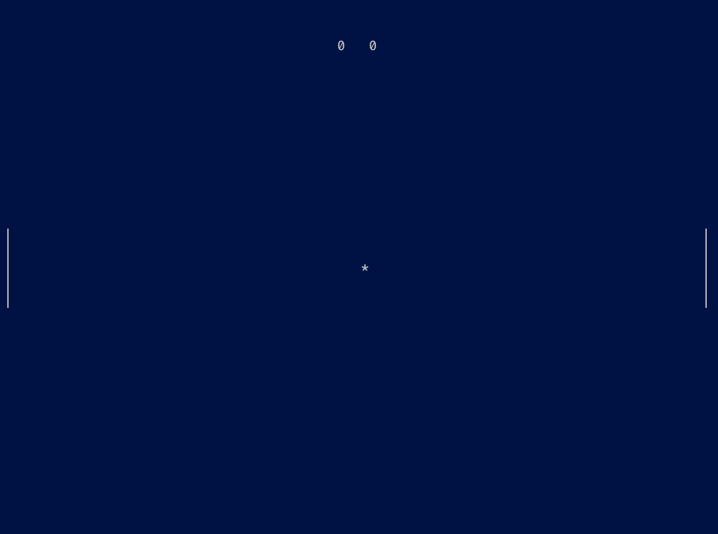

# Pong

## GamePlay

This game is designed for 2 players using a single keyboard. Once compiled it will run on any OS/Architecture, since the only requirement is a TTY interface it can even be played via SSH on a remote system. Score is depicted in the top middle of the screen.

The game starts with the ball in the middle of the screen and randomly chooses if the ball is moving left or right. If the ball hits the left or right boundary a point is awarded to the opposite side. If the ball hits a paddle it will bounce with a modified trajectory. First side to 5 points wins, at which point the game exits.



### Control Keys

| Key | Action            |
|-----|-------------------|
| Esc | Exit Game         |
| W   | Right Paddle Up   |
| A   | Right Paddle Down |
| I   | Left Paddle Up    |
| K   | Left Paddle Down  |

## Build

The program will build and run on Windows, MacOS or Linux. You just need to make sure you have a recent verison of [Go](https://go.dev/dl/) installed and run the following commands.

```Shell
git clone https://github.com/AWDDude/codewars.git
cd codewars/pong/
go build .
```

## Architecture

The program utilizes the `github.com/gdamore/tcell/v2` package for rendering ascii characters to the screen. A `tcell.screen` instance is instantiated, which keeps track of, and modifies, the screen's state. I created a `component` sub-package to hold the state of each object on screen (ball, paddles, and scoreboard). Each component instance is in charge of rendering themselves on the `screen`, which is passed as a parameter to each component's `Render()` method.

### Threading

This program could very easily be implemented with a single thread, but I wanted to make it multithreaded. So I decided to use 3 separate go routines for; capturing keyboard input, rendering the screen, and moving the ball/keeping track of score. For movement, each component has a channel to receive movement instructions. I also utilize `sync.Mutex` to ensure thread safety for each component's properties.
